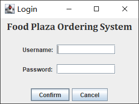
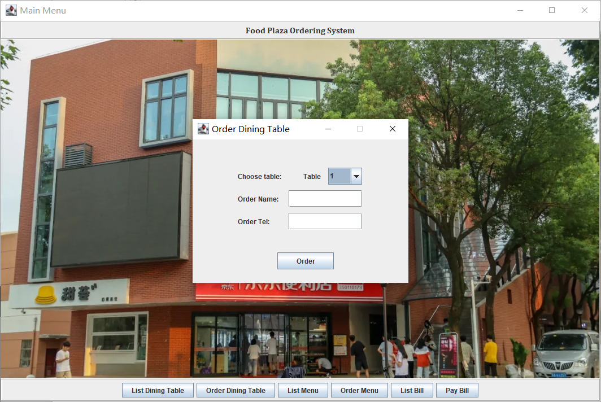

# food-plaza-ordering-system


## 功能

* 登录
* 显示餐桌状态
* 预定餐桌
* 显示所有菜品
* 点餐
* 显示账单
* 结账


## 项目目录结构

```
food-plaza-ordering-system                 
├─ libs                                    
│  ├─ commons-dbutils-1.3.jar              
│  ├─ druid-1.2.14.jar                     
│  └─ mysql-connector-java-5.1.49-bin.jar  
├─ src                                     
│  ├─ com                                  
│  │  └─ fyh                               
│  │     └─ ordering_system                
│  │        ├─ dao                         
│  │        │  ├─ BasicDAO.java            
│  │        │  ├─ BillDAO.java             
│  │        │  ├─ DiningTableDAO.java      
│  │        │  ├─ EmployeeDAO.java         
│  │        │  └─ MenuDAO.java             
│  │        ├─ domain                      
│  │        │  ├─ Bill.java                
│  │        │  ├─ DiningTable.java         
│  │        │  ├─ Employee.java            
│  │        │  └─ Menu.java                
│  │        ├─ service                     
│  │        │  ├─ BillService.java         
│  │        │  ├─ DiningTableService.java  
│  │        │  ├─ EmployeeService.java     
│  │        │  └─ MenuService.java         
│  │        ├─ utils                       
│  │        │  ├─ JDBCUtilsByDruid.java    
│  │        │  └─ Utility.java             
│  │        └─ view                        
│  │           ├─ images                   
│  │           │  └─ FoodPlaza.jpg         
│  │           ├─ ListBill.java            
│  │           ├─ ListDiningTable.java     
│  │           ├─ ListMenu.java            
│  │           ├─ Login.java               
│  │           ├─ MainFrame.java           //GUI程序
│  │           ├─ MainMenu.java            
│  │           ├─ OrderDiningTable.java    
│  │           ├─ OrderMenu.java           
│  │           ├─ PayBill.java             
│  │           └─ View.java                //控制台程序
│  └─ druid.properties                     
├─ ordering-system.sql                     
└─ README.md                               

```


## 示例图片





